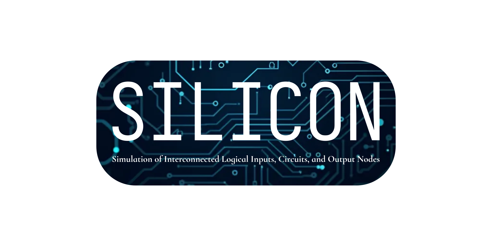

An Open Source Suite for simulating Circuits, Finite State Machines and Microcontrollers (WIP)

## TODOs
Since it's a pre-alpha product, there are quite a lot of things to be done:

_Common_

- [ ] GUI with QT6

_Logic circuits (Silicon LogiFlow)_

- [ ] Multiplexers & demultiplexers
- [ ] Timed simulation
- [ ] Flip flops & synchronous components
- [ ] Wires-to-bus & bus-to-wires
- [ ] INPUTS & OUTPUTS!!!!
- [ ] Bus display
- [ ] 7-segment display
- [ ] Verilog support
  * [ ] [Slang](https://github.com/MikePopoloski/slang) for parsing
  * [ ] [Inja](https://github.com/pantor/inja) for reverse parsing (needs template file)
- [ ] File format
  * [ ] Implement [Quine-McCluskey method](https://en.wikipedia.org/wiki/Quine%E2%80%93McCluskey_algorithm) to minimize the combinatorial logic net
  * [ ] Using verilog & Slang?

_FSMs_

- [ ] TBD

_Microcontrollers_

- [ ] TBD
